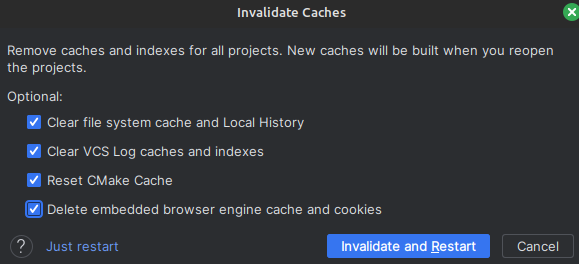

# Say Hello
## Show message passing from python to cpp

Purpose is to prototype a quick hello-world message passing from python to c++

### How build works


Steps if you're not using an IDE (assuming you're in the project dir):

```shell
cmake -S . -B cmake-build-debug
cmake --build ./cmake-build-debug --target all -j 14
cmake --install cmake-build-debug
```

### Calling from python

```python
from ctypes import cdll, create_string_buffer
lib = cdll.LoadLibrary('./libsayhello.so')
buzz = create_string_buffer("buzz!".encode("UTF-8"))
lib.Hello(buzz)
```

expected result

```shell
You passed: buzz!
Hello, buzz!
1
```

### TIPS

* If you see `"It was created with incompatible generator "'Unix Makefiles'`
  * Invalidate all with all the following boxes ticked
    * 
* Automating the cmake build
  * When you select `build`
  * You can see that the command is `home/aaswin/.local/share/JetBrains/Toolbox/apps/clion/bin/cmake/linux/x64/bin/cmake --build /home/aaswin/CLionProjects/sayhello/cmake-build-debug --target all -j 14`
* Tutorial on cmake
  * https://www.jetbrains.com/help/clion/quick-cmake-tutorial.html#link-libs
* Installing latest cmake
  * https://askubuntu.com/questions/829310/how-to-upgrade-cmake-in-ubuntu
* Building the cmake file from CLI: https://earthly.dev/blog/ninjabuild-for-faster-build/
* Passing string results from unmanaged code back to calling python function
  * You DON'T - it causes memory leak, unless it's made static which's also botched
    * Even returning an array is problematic as none will be there to clean it up https://stackoverflow.com/questions/14887378/how-to-return-array-from-c-function-to-python-using-ctypes
    * A possibility is to call another extern function to free up the array when done.
  * You reserve the memory from the python side for example: https://stackoverflow.com/questions/45178140/returning-string-from-c-function-with-ctypes-gives-large-int-not-char-pointer
  * Here is how you can pass classes back and forth https://stackoverflow.com/questions/19198872/how-do-i-return-objects-from-a-c-function-with-ctypes